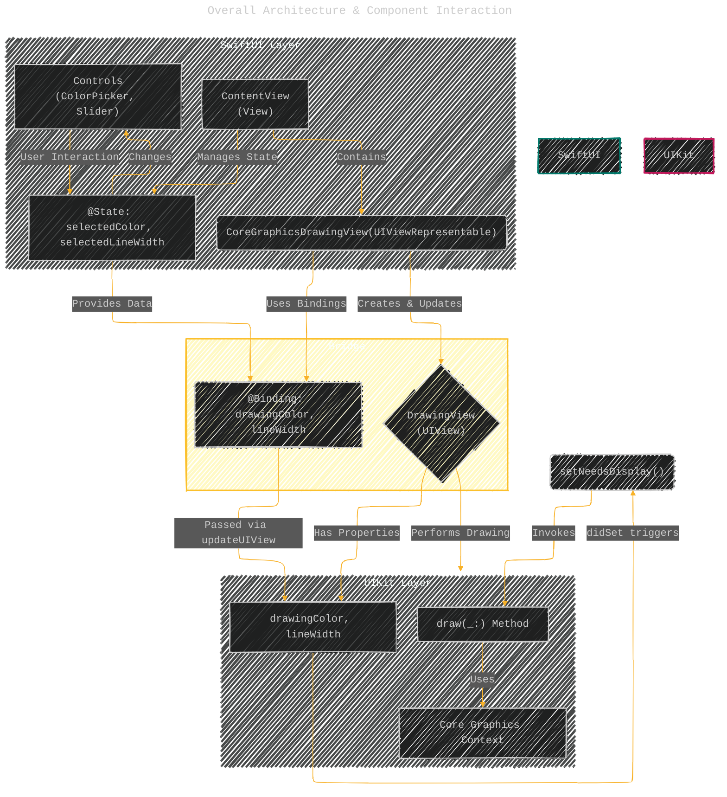
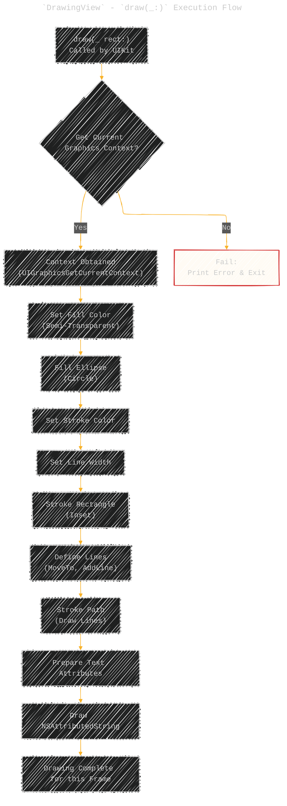
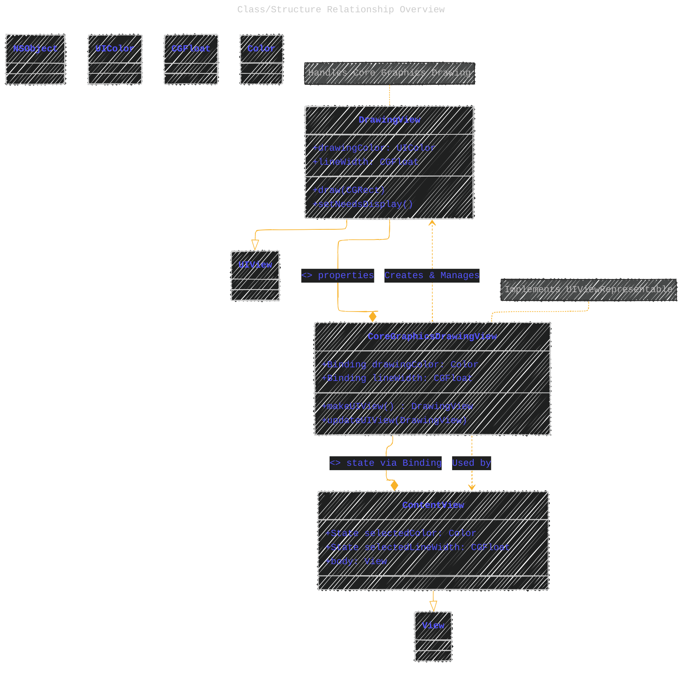

# A Diagrammatic Guide
> **Disclaimer:**
>
> This document contains my personal notes on the topic,
> compiled from publicly available documentation and various cited sources.
> The materials are intended for educational purposes, personal study, and reference.
> The content is dual-licensed:
> 1. **MIT License:** Applies to all code implementations (Swift, Mermaid, and other programming languages).
> 2. **Creative Commons Attribution 4.0 International License (CC BY 4.0):** Applies to all non-code content, including text, explanations, diagrams, and illustrations.
---

First, a quick summary of the code:

This Swift code demonstrates how to integrate a custom `UIView` that performs Core Graphics drawing into a SwiftUI application. It achieves this using the `UIViewRepresentable` protocol.

1.  **`DrawingView` (UIKit `UIView`):** This class handles the actual drawing using Core Graphics within its `draw(_:)` method. It has properties (`drawingColor`, `lineWidth`) that control the appearance of the drawing. When these properties change, it triggers a redraw using `setNeedsDisplay()`.
2.  **`CoreGraphicsDrawingView` (SwiftUI `UIViewRepresentable`):** This struct acts as a bridge between SwiftUI and the UIKit `DrawingView`. It creates (`makeUIView`) and updates (`updateUIView`) the `DrawingView` instance, passing data from SwiftUI's state (`@Binding` variables) to the `DrawingView`'s properties.
3.  **`ContentView` (SwiftUI `View`):** This is the main SwiftUI view. It holds the state variables (`@State`) for color and line width, displays the `CoreGraphicsDrawingView`, and provides UI controls (`ColorPicker`, `Slider`) to modify the state, which in turn updates the drawing.

Here are the diagrams illustrating these concepts:

---

## 1. Overall Architecture & Component Interaction

This diagram shows the main components and how they relate to each other.

**Explanation:**

*   **SwiftUI Layer:** `ContentView` holds the UI controls and the state variables. It includes the `CoreGraphicsDrawingView`.
*   **Bridge:** `CoreGraphicsDrawingView` acts as the intermediary, using `@Binding` to receive data from `ContentView`'s `@State`. It manages the lifecycle of the `DrawingView`.
*   **UIKit Layer:** `DrawingView` is the custom UIKit view. It receives property updates from the bridge and uses its `draw(_:)` method with Core Graphics to render content.
*   **Data Flow:** User interaction changes `@State`, which updates the `@Binding`, triggering `updateUIView` in the representable. This sets properties on `DrawingView`, whose `didSet` observers call `setNeedsDisplay()`, leading UIKit to eventually call `draw(_:)`.

---

## 2. Data Flow on State Change (e.g., User Adjusts Slider)

This sequence diagram illustrates the flow of events when a SwiftUI control modifies the state.

**Explanation:**

1.  The user interacts with a control (e.g., `Slider`).
2.  The control updates the corresponding `@State` variable in `ContentView`.
3.  SwiftUI automatically detects the state change and calls the `updateUIView` method of the `CoreGraphicsDrawingView` representable.
4.  `updateUIView` updates the `lineWidth` property on the `DrawingView` instance.
5.  The `didSet` property observer on `lineWidth` in `DrawingView` is triggered and calls `setNeedsDisplay()`.
6.  This signals to the UIKit framework that the view needs to be redrawn.
7.  At the next appropriate time in the rendering cycle, UIKit calls the `draw(_:)` method of the `DrawingView`.
8.  The `draw(_:)` method executes, using the *new* `lineWidth` value to draw the content.

----

## 3. `UIViewRepresentable` Lifecycle Methods

This flowchart shows the primary lifecycle methods of the `UIViewRepresentable` used in this code.

**Explanation:**

*   **`makeUIView`:** Called *once* when SwiftUI initially needs to create the underlying UIKit view (`DrawingView`). It's responsible for instantiation and initial configuration.
*   **`updateUIView`:** Called whenever the data bound via `@Binding` changes in the SwiftUI environment. It's responsible for passing the updated data to the existing `DrawingView` instance.
*   **Optional Methods:** `makeCoordinator` (for delegates/callbacks) and `sizeThatFits` (for layout suggestions) are not implemented in this specific example but are part of the `UIViewRepresentable` protocol.

---

## 4. `DrawingView` - `draw(_:)` Execution Flow

This flowchart details the steps taken within the `draw(_:)` method of the `DrawingView`.

**Explanation:**

1.  The process starts when UIKit invokes `draw(_:)`.
2.  It critically depends on getting the current graphics context (`CGContext`). If this fails, drawing cannot proceed.
3.  A sequence of Core Graphics commands are executed:
    *   Setting fill color and drawing a filled shape (ellipse).
    *   Setting stroke color and line width, then drawing stroked shapes (rectangle, lines).
    *   Preparing text attributes and drawing text using `NSAttributedString`.
4.  Each step builds upon the previous ones within the same drawing context for that frame.

----

## 5. Class/Structure Relationship Overview

A simplified diagram showing the types and their primary roles/members.

**Explanation:**

*   Shows the inheritance (`--|>`) and composition/dependency relationships (`-->`, `..>`).
*   Highlights key properties (`@State`, `@Binding`, regular properties) and methods (`makeUIView`, `updateUIView`, `draw`).
*   Illustrates that `CoreGraphicsDrawingView` acts as the bridge connecting the SwiftUI `ContentView` state to the UIKit `DrawingView`'s drawing capabilities.

---
**Licenses:**

- **MIT License:**   - Full text in [LICENSE](LICENSE) file.
- **Creative Commons Attribution 4.0 International:**  - Legal details in [LICENSE-CC-BY](LICENSE-CC-BY) and at [Creative Commons official site](http://creativecommons.org/licenses/by/4.0/).

---